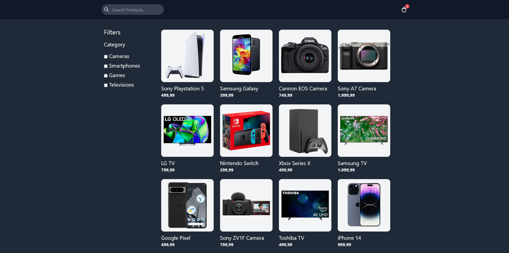

# Products Filtering

This is a practice repository of the [Products Filtering UI](https://youtu.be/Hwyyk1Ueoig?si=SJXIwzSu9ebJ1ztE) project from [Traversy Media](https://www.youtube.com/@TraversyMedia).

## Table of contents

-   [Overview](#overview)
    -   [The challenge](#the-challenge)
    -   [Screenshot](#screenshot)
    -   [Links](#links)
-   [My process](#my-process)
    -   [Built with](#built-with)
    -   [What I learned](#what-i-learned)
    -   [Continued development](#continued-development)
    -   [Useful resources](#useful-resources)
-   [Author](#author)

## Overview

### The challenge

-   Understanding how to do DOM manipulation
-   Understand how to code filtering logic

### Screenshot



### Links

-   Solution URL: [GitHub](https://github.com/mikailafsin/products-filtering)
-   Live Site URL: [Vercel](https://products-filtering-three.vercel.app/)

## My process

### Built with

-   HTML5 markup
-   Flexbox
-   Mobile-first workflow
-   JavaScript
-   [Tailwind CSS](https://tailwindcss.com/) - CSS framework

### What I learned

In this project, I learnt how to do DOM manipulation and how to code filtering logic.

```js
// Filter products by checkboxes and search input
function filterProducts() {
    // Get search term
    const searchTerm = searchInput.value.trim().toLowerCase();
    // Get checked categories
    const checkedCategories = Array.from(checkboxes)
        .filter((check) => check.checked)
        .map((check) => check.id);

    // Loop over products and check for matches
    productElements.forEach((productElement, index) => {
        const product = products[index];

        // Check to see if the product matches the search or the checked categories
        const matchesSearchTerm = product.name.toLowerCase().includes(searchTerm);
        const isInCheckedCategory = checkedCategories.length === 0 || checkedCategories.includes(product.category);

        // Show or hide product based on matches
        if (matchesSearchTerm && isInCheckedCategory) {
            productElement.classList.remove("hidden");
        } else {
            productElement.classList.add("hidden");
        }
    });
}
```

### Continued development

In future projects I will continue to code more DOM manipulation and various logic with JavaScript.

### Useful resources

-   [Tailwind & JavaScript Project - Products Filtering UI](https://youtu.be/Hwyyk1Ueoig?si=XlMDDXXK5HifrQFc) - This helped me to implement the project and understand the concepts.

## Author

-   Instagram - [@mikail.afsin](https://www.instagram.com/mikail.afsin)
